# Ian Xiaohei Illustrations

> Turn the key judgment, flow, state, or metaphor in a Chinese article into a
> clean, white-background, hand-drawn, slightly absurd inline illustration.
>
> 16:9 horizontal | Xiaohei IP | Xiaoquan option | Traditional Chinese output |
> Codex Skill

## Origin And Adaptation

This repository is adapted from Ian's original project:
[helloianneo/ian-xiaohei-illustrations](https://github.com/helloianneo/ian-xiaohei-illustrations).

The upstream project defines the Xiaohei hand-drawn article-illustration skill:
the visual IP, composition rules, image-generation prompt pattern, QA checklist,
and examples for Chinese articles, posts, blogs, and methodology writing.

This adapted version keeps the core visual language while adding Taiwan-focused
usage rules and a stricter image-generation provenance policy.

主要改編內容：

- 將 Markdown 與 YAML 文件從簡體中文轉為台灣慣用繁體中文。
- 調整部分用語為台灣內容出版語境，例如「貼文」、「部落格」、「內文配圖」、「橫式」、「影像」。
- 明確要求所有中文輸出使用台灣慣用繁體中文，包含 shot list、圖片標註建議、交付說明、檔名說明與改圖指示。
- 在圖片生成提示詞中加入台灣繁體中文約束，要求圖片上的中文手寫標註使用台灣慣用繁體中文，並避免產生簡體中文。
- 新增可選原創吉祥物「小拳」，用於表達「直接切入核心」、「拆掉阻塞」、「把複雜問題壓成一個可行動作」等概念。
- 新增小拳 `image_gen` 示例圖，並要求所有 README / skill 示例圖必須逐張由 `image_gen` 生成。
- 禁止使用 PIL、SVG、Canvas、HTML、Matplotlib、Graphviz、自寫繪圖腳本或流程圖工具產生示例圖內容；程式只能用於搬移、命名、壓縮或檢查檔案。

## What This Repository Is

Ian Xiaohei Illustrations is a Codex Skill for creating inline illustrations
for Chinese writing. It is designed for articles, posts, blogs, Notion notes,
workflow documents, and methodology writing.

It is not a generic illustration prompt, a commercial vector style, or a PPT
infographic template. The skill first identifies a cognitive anchor in the
writing, then turns one judgment, flow, structure, state, or metaphor into a
single memorable 16:9 hand-drawn explanation sketch.

The default visual IP is **小黑 / Xiaohei**: a small solid-black character with
white dot eyes, thin legs, and a blank serious expression. Xiaohei must perform
the core conceptual action, not stand aside as decoration.

This adapted version also supports the optional original mascot **小拳 /
Xiaoquan**. Xiaoquan is a quiet, minimal problem-solving character with one
slightly larger glove-like fist used as a conceptual tool. It is not based on
any existing manga, anime, game, or brand character.

## Thinking Character System

This repository treats mascots as visual thinking functions, not as a character
universe. Each mascot answers one conceptual question:

- 小黑: 哪裡怪怪的？
- 小拳: 什麼可以砍掉？
- 小藍: 結構是什麼？
- 小綠: 它怎麼長大？
- 小紫: 哪裡會壞掉？
- 小黃: 還能怎麼想？

The six-role system is documented in:

- [docs/VISUAL_SYSTEM.md](docs/VISUAL_SYSTEM.md)
- [references/mascot-cards.yaml](references/mascot-cards.yaml)
- [references/metaphor-cards.md](references/metaphor-cards.md)
- [examples/shot-lists.md](examples/shot-lists.md)
- [examples/themes/](examples/themes/)

The role limit is intentional. Adding more mascots risks turning the project
into lore instead of a tool for explaining ideas.

## Thinking Role Samples

These images are the first role-system samples generated one-by-one with
`image_gen`. They test only the minimum starting set before expanding the
remaining roles:

### 小黑：異常觀察

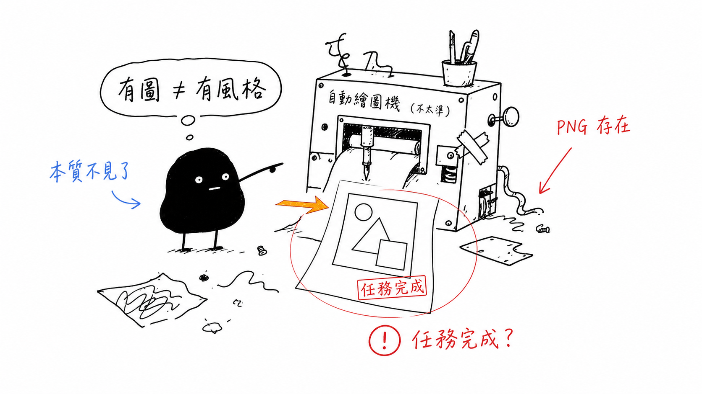

### 小拳：壓縮執行

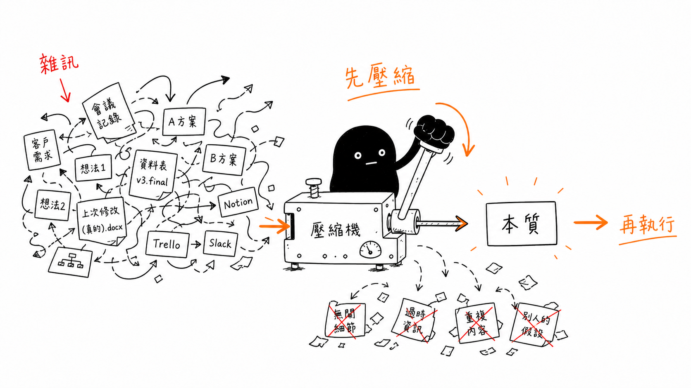

### 小紫：審查風險

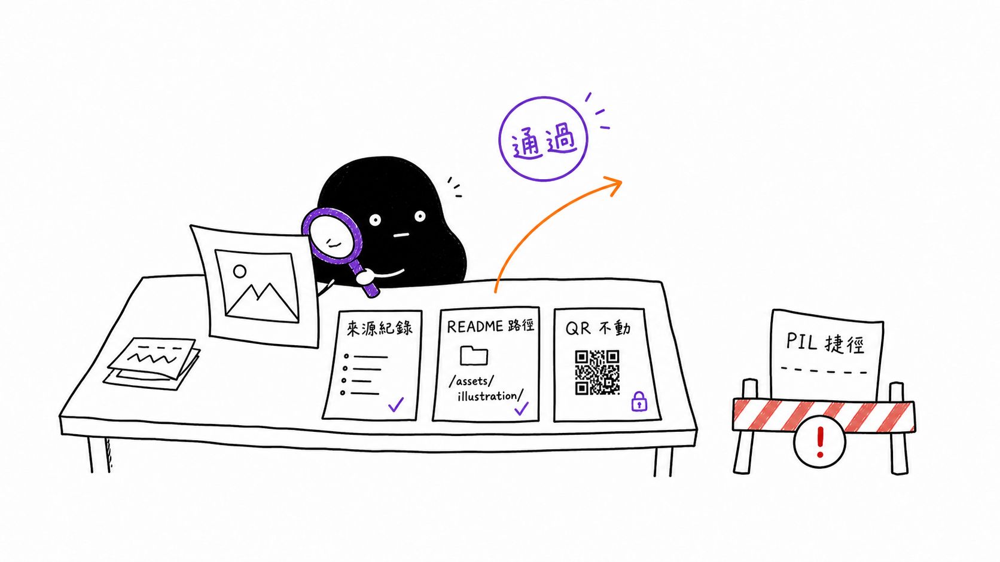

Provenance records are stored in
[examples/images/thinking-roles-v0/README.md](examples/images/thinking-roles-v0/README.md).

## Intended Users

This skill is useful for:

- Chinese writers who need inline article illustrations.
- Knowledge workers creating methodology, AI workflow, or product-thinking
  content.
- Builders who want to turn abstract judgment into concrete visual metaphors.
- Codex users who want a repeatable visual language for Chinese content.

It is not intended for:

- Brand key visuals, polished commercial illustration, or poster art.
- Traditional PPT diagrams, dense architecture diagrams, or formal flowcharts.
- Children's illustration, cute stickers, or emoji-like mascots.
- Long text-heavy infographics.
- Editable vector source files.

## Outputs

Default outputs:

- 16:9 horizontal inline article illustrations.
- A 4-8 image shot list for an article.
- Per-image topic, core idea, structure type, mascot action, suggested elements,
  and Chinese label suggestions.
- Final PNG images saved under `assets/<article-slug>-illustrations/`.

Default non-goals:

- PPTX / PDF / Keynote.
- SVG / HTML / Canvas editable graphics.
- Commercial posters or cover key visuals.
- Dense text-based infographics.

## Visual Style

The default style follows Ian's Xiaohei hand-drawn article-illustration language:

- Pure white background; no paper texture, beige tint, shadows, gradients, or
  visual noise.
- Minimal black hand-drawn line art with slight wobble.
- Large blank space; the main subject usually occupies around 40%-60% of the
  canvas.
- Sparse red, orange, and blue handwritten Chinese annotations.
- One image explains one core action, structure, state, or metaphor.
- Xiaohei or the selected mascot must perform the core action.
- Strange, thoughtful, clean, and restrained; not cute or childish.

When the user requests Xiaoquan, the same white-background, hand-drawn,
high-whitespace style remains. The core action shifts from Xiaohei to Xiaoquan,
who should behave like a quiet problem solver in a whiteboard sketch, not a
hero or combat character.

## Examples

### 兩個斷點

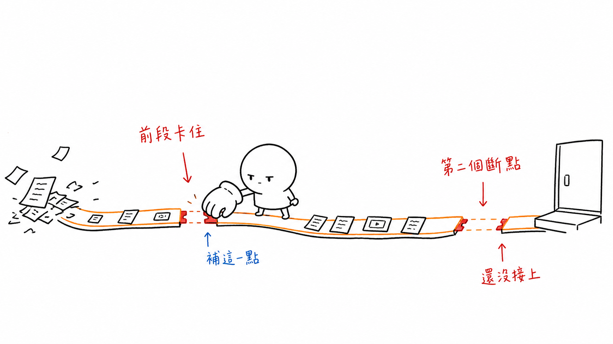

### 按目的分揀

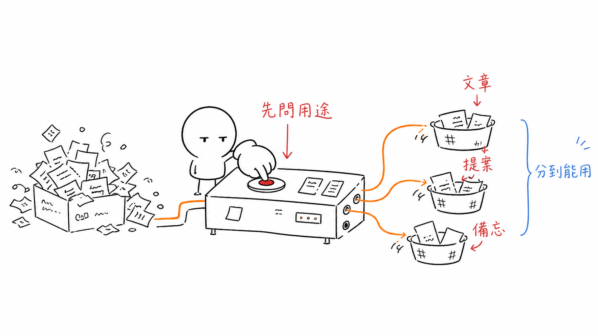

### 一魚多吃

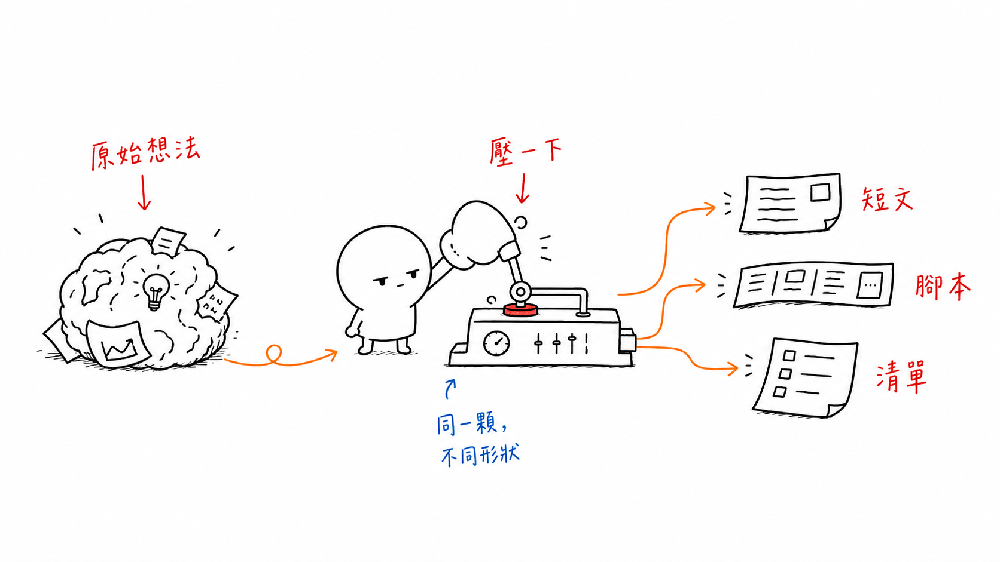

### 承接路徑

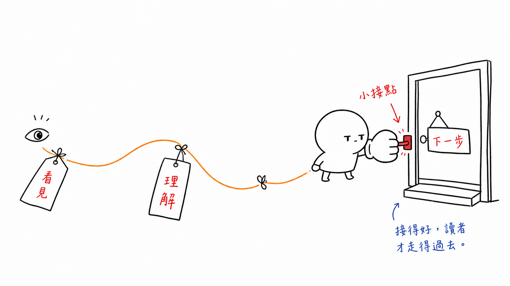

### 資訊井

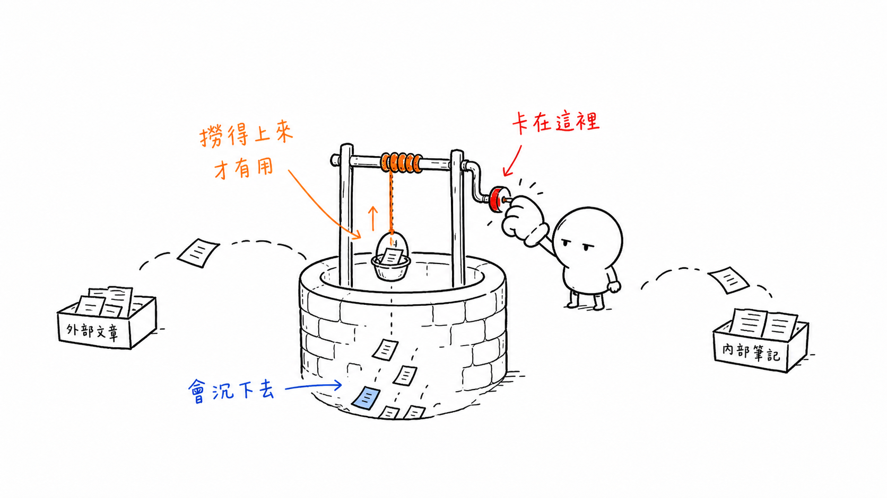

### 想法壓機

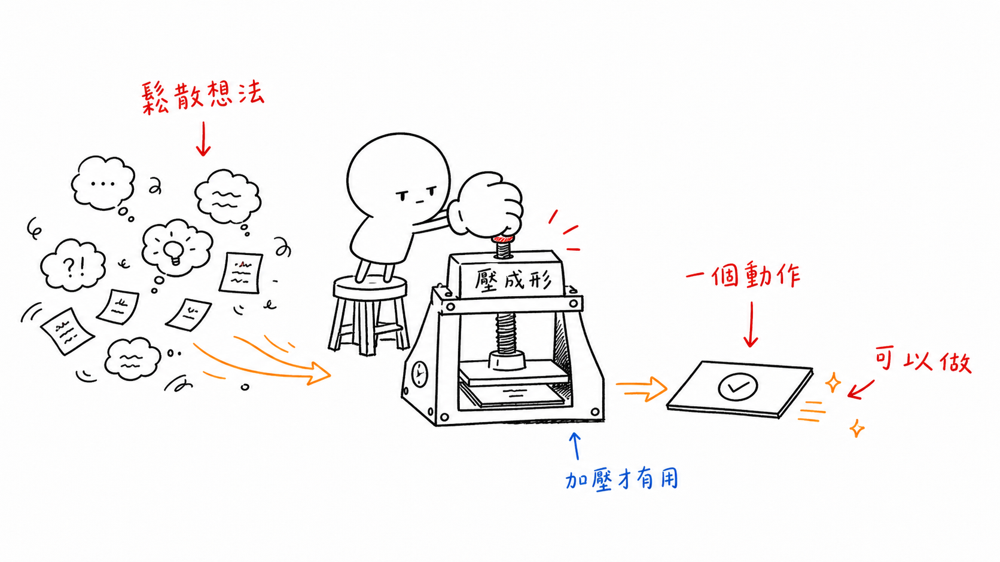

### 內容發酵

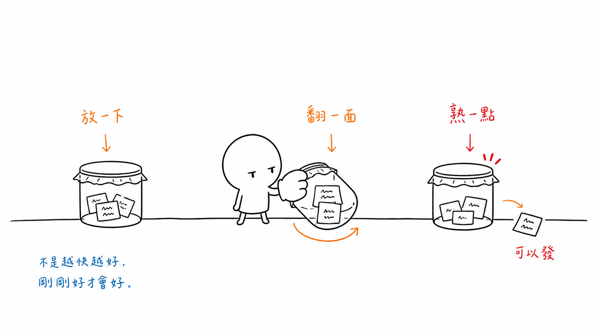

### 信任橋

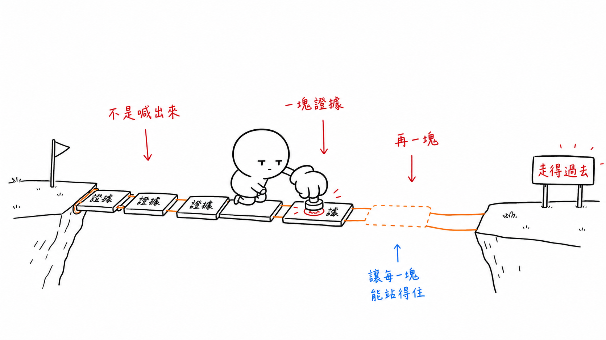

These images are style-calibration examples, not composition templates. For new
work, invent a fresh metaphor from the current article instead of copying old
objects, layouts, or labels.

Example provenance rule: README and skill example images must be generated
one-by-one through `image_gen`. PIL, SVG, Canvas, HTML, Matplotlib, Graphviz,
self-written drawing scripts, screenshots, or diagram tools may only be used
for file handling. They must not create the visual content.

## Installation

Clone this adapted repository:

```bash
git clone git@github.com:JasonLn0711/codex-skill-ian-xiaohei-illustrations.git
cd codex-skill-ian-xiaohei-illustrations
```

Copy the skill folder into your Codex skills directory:

```bash
mkdir -p "${CODEX_HOME:-$HOME/.codex}/skills"
cp -R ./ian-xiaohei-illustrations "${CODEX_HOME:-$HOME/.codex}/skills/"
```

Then invoke the skill in Codex:

```text
Use $ian-xiaohei-illustrations 為這篇中文文章設計並生成 5 張小黑怪誕內文配圖。
```

## Usage

The copied prompts below intentionally keep Chinese where the skill output or
image labels should be Chinese.

### Plan Illustrations Without Generating Images

```text
Use $ian-xiaohei-illustrations 先不要生成圖片。
請分析下面這篇文章哪裡值得配圖，輸出 5 張左右的 shot list。
每張圖寫清楚：放在哪段後、主題、核心意思、結構類型、吉祥物在做什麼、建議中文標註詞。

<貼上文章>
```

### Generate Article Illustrations

```text
Use $ian-xiaohei-illustrations 把下面這篇文章生成 4 張小黑怪誕內文配圖。
要求：16:9 橫式、純白背景、黑色手繪線稿、少量紅橙藍中文手寫批註。

<貼上文章>
```

### Generate One Concept Image

```text
Use $ian-xiaohei-illustrations 為「信任不是喊出來的，而是一塊證據一塊證據鋪過去」生成一張內文配圖。
畫面要怪誕但清爽，小黑必須承擔核心動作。
```

### Use Xiaoquan

```text
Use $ian-xiaohei-illustrations 使用小拳，為「把複雜問題壓成一個可行動作」生成一張 16:9 內文配圖。
小拳要像冷靜的問題拆解員，用一個很小但精準的動作打通阻塞；不要使用任何既有漫畫、動畫、遊戲或品牌角色的造型。
```

### Remove An Unwanted Title

```text
Use $ian-xiaohei-illustrations 幫我編輯這張圖，去掉左上角的「流程圖」標題，其他內容保持不變。
```

More copyable prompts are available in [examples/prompts.md](examples/prompts.md).

## Workflow

The skill workflow is:

1. Read the article, Markdown file, Notion content, screenshot, or concept.
2. Identify the core claim, cognitive turn, flow structure, or visualizable
   paragraph.
3. Create a shot list; each image should own one cognitive anchor.
4. Choose a structure type: workflow, system slice, before/after contrast,
   character state, conceptual metaphor, method layers, route map, or small
   comic sequence.
5. Invent a low-tech, strange-but-valid physical metaphor.
6. Make the selected mascot perform the core action; use Xiaohei by default.
7. Generate each image separately through `image_gen`.
8. Check the QA rules: white background, whitespace, mascot action, Chinese
   labels, non-PPT feeling, and no old-example copy.
9. Save final PNG images and report their purpose and path.

## Repository Layout

```text
.
├── README.md
├── LICENSE
├── NOTICE.md
├── assets/
│   └── ian-wechat-qr.jpg
├── docs/
│   ├── GENERATION_PROTOCOL.md
│   └── VISUAL_SYSTEM.md
├── examples/
│   ├── images/
│   │   ├── 01-two-breakpoints.png
│   │   ├── 02-sort-by-purpose.png
│   │   ├── ...
│   │   ├── thinking-roles-v0/
│   │   └── xiaoquan-generated/
│   ├── shot-lists.md
│   ├── themes/
│   └── prompts.md
├── references/
│   ├── mascot-cards.yaml
│   └── metaphor-cards.md
├── scripts/
│   └── check_repo_rules.py
└── ian-xiaohei-illustrations/
    ├── SKILL.md
    ├── agents/
    │   └── openai.yaml
    ├── assets/
    │   └── examples/
    └── references/
        ├── style-dna.md
        ├── xiaohei-ip.md
        ├── mascots/
        │   ├── README.md
        │   └── xiaoquan.md
        ├── composition-patterns.md
        ├── prompt-template.md
        └── qa-checklist.md
```

The actual Codex Skill folder is:

```text
ian-xiaohei-illustrations/
```

The repository root contains GitHub-facing documentation, license files, and
examples.

## Notes

- 中文輸出、圖片標註建議與交付說明一律使用台灣慣用繁體中文。
- 圖片裡的中文文字越短越穩定。
- Each image should explain only one core structure.
- Xiaohei must perform the core action; if removing Xiaohei leaves the image
  fully intact, the prompt is too decorative.
- Xiaoquan must also perform the core action when selected.
- Xiaoquan is an original optional mascot and must not use any existing manga,
  anime, game, or brand character design, costume, face, name, logo, or
  worldbuilding.
- Examples are for line density, whitespace, color restraint, and mascot
  participation. Do not copy the compositions by default.
- AI image models may produce typoed labels, stray headings, or style drift.
  Check and regenerate when needed.

## Attribution

- Original project: [helloianneo/ian-xiaohei-illustrations](https://github.com/helloianneo/ian-xiaohei-illustrations), created by Ian.
- Adapted by: Jason-C.S. / [JasonLn0711](https://github.com/JasonLn0711)
- Contact: <JasonLn0711@users.noreply.github.com>

## About The Adapter

Jason-C.S. maintains this adapted Codex Skill for Taiwan Traditional Chinese
content workflows, original mascot experimentation, and reproducible
AI-generated illustration pipelines.

- GitHub: [JasonLn0711](https://github.com/JasonLn0711)
- Contact: <JasonLn0711@users.noreply.github.com>

## License

MIT License. See [LICENSE](LICENSE).
