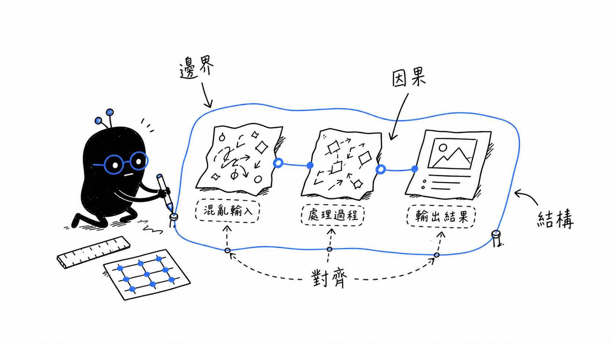
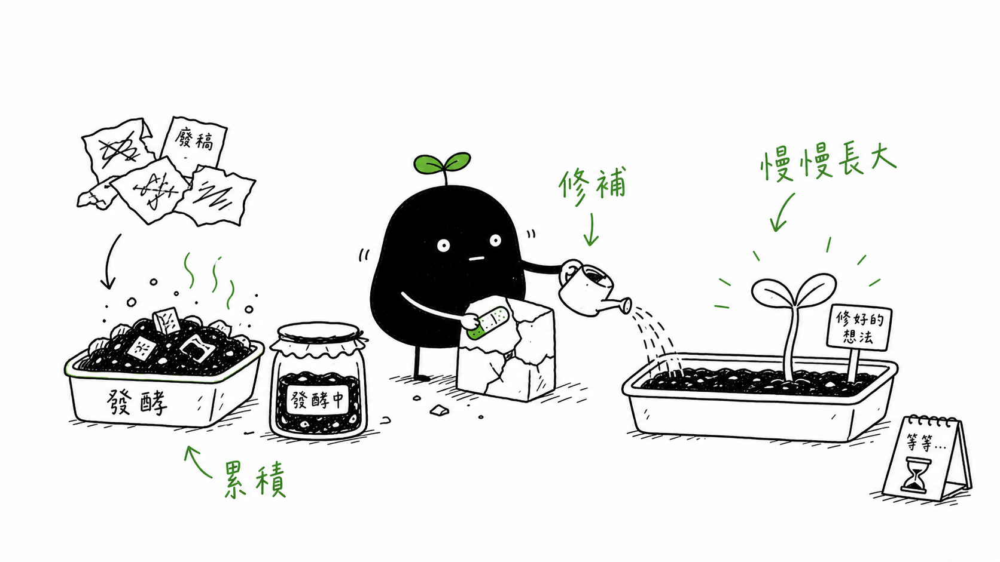
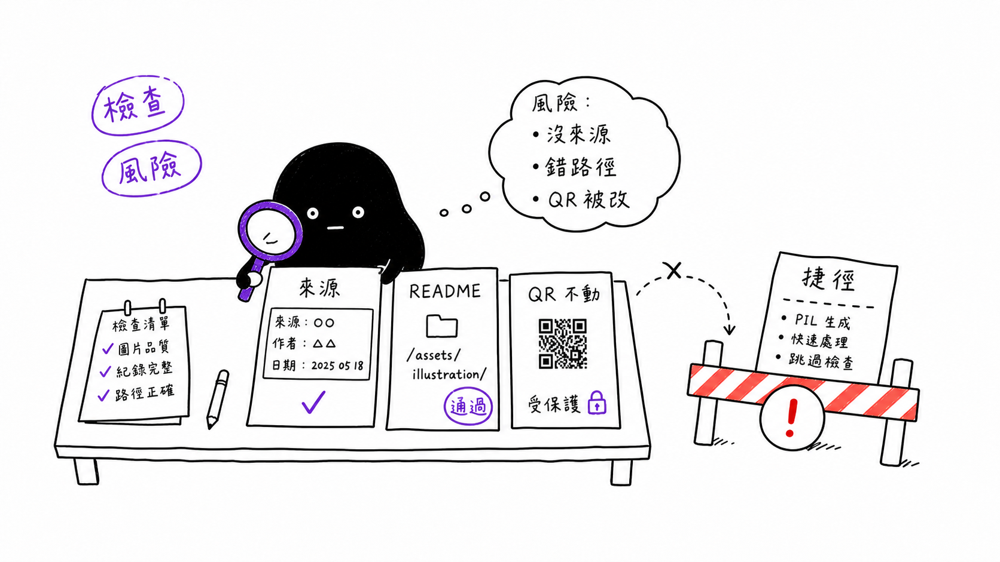
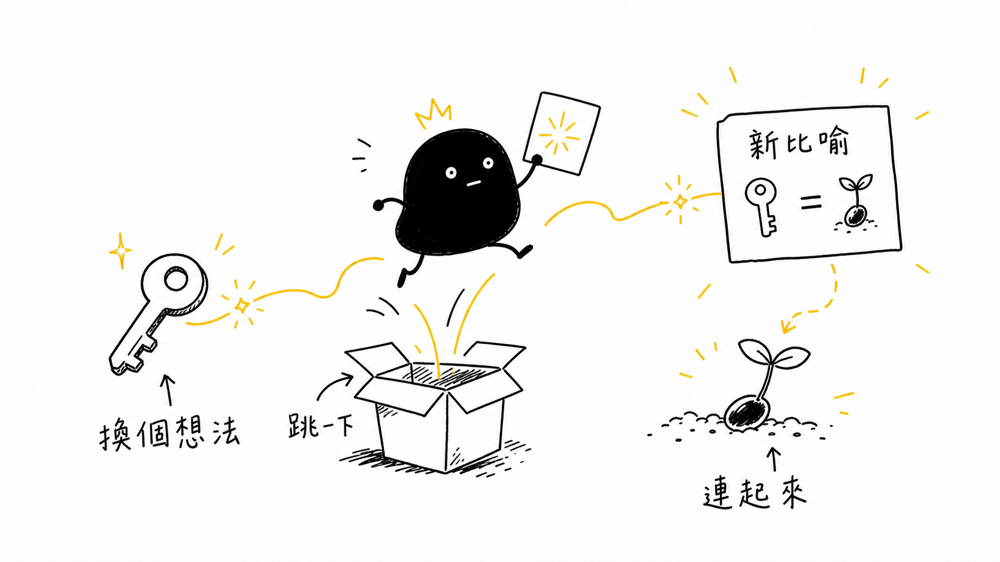
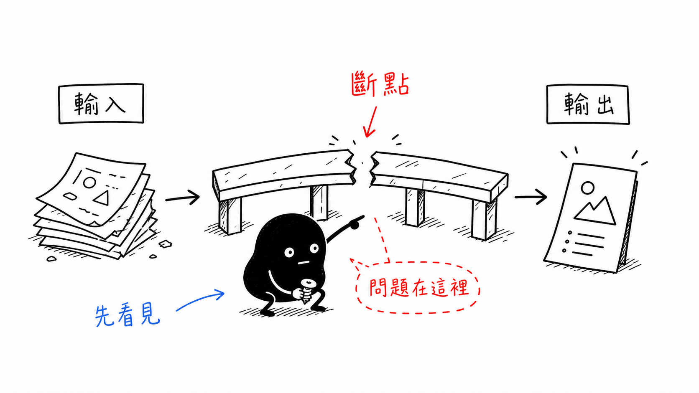
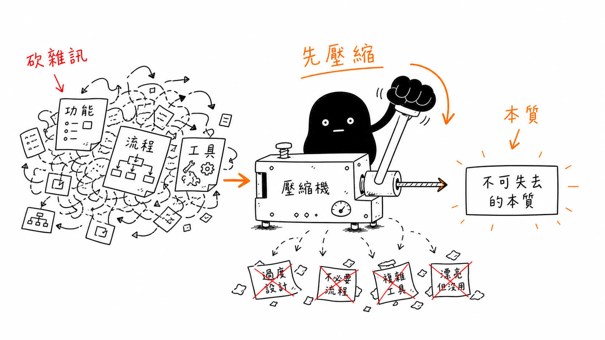
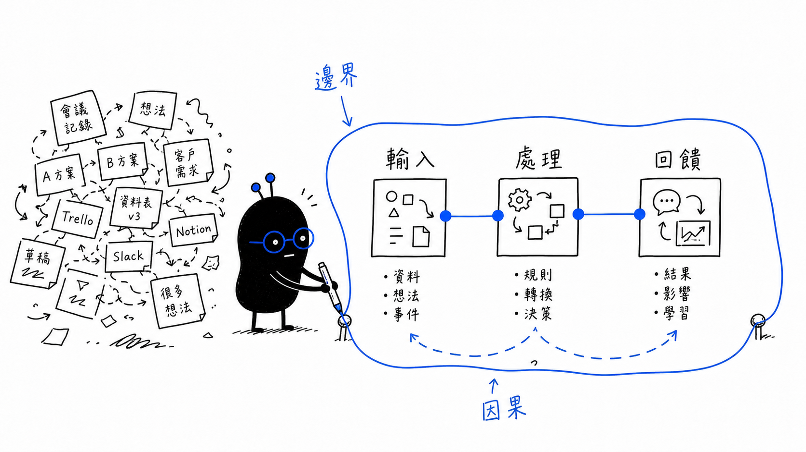
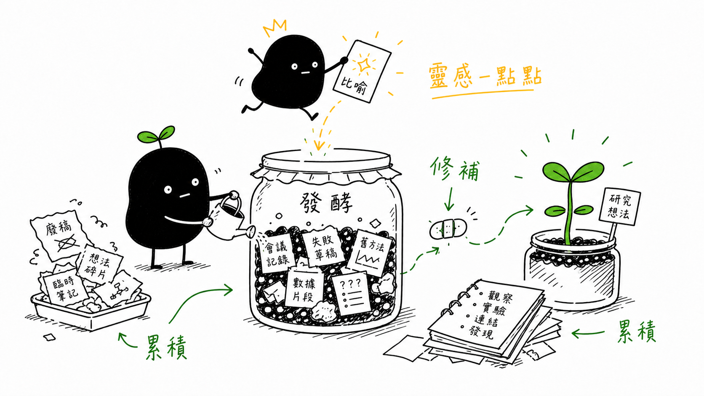
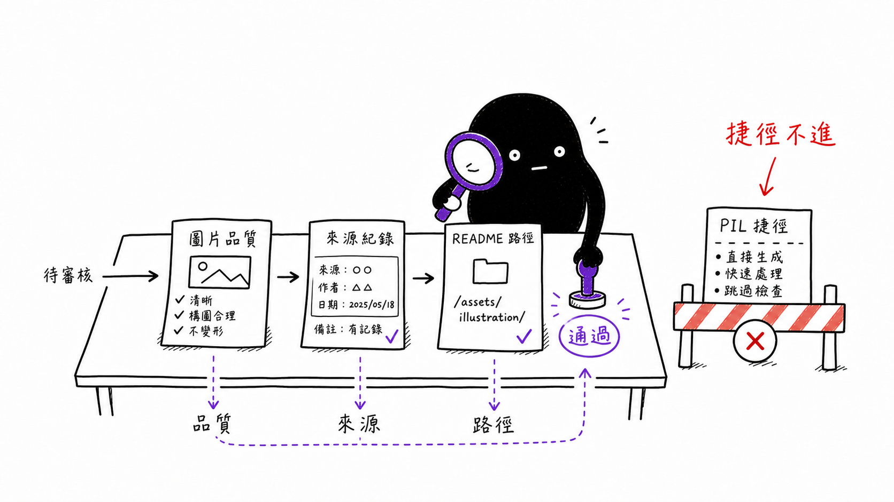

# Ian Xiaohei Illustrations

<p>
  
  
  
  
</p>

Turn the key judgment, flow, state, or metaphor in a Chinese article into a
clean, white-background, hand-drawn, slightly absurd inline illustration.

This adapted repo upgrades the original Xiaohei illustration skill into a
bounded **thinking role system**. Mascots are not lore. Each mascot is a visual
interface for one thinking function.

## Quick Navigation

- [Role Samples](#role-samples): see all six mascot roles first.
- [Article Examples](#article-examples): five role-based example images.
- [Use The Skill](#use-the-skill): install and run the Codex skill.
- [Rules](#rules): visual, provenance, and generation constraints.
- [Attribution](#attribution): upstream and adapter information.

## Role Samples

The six roles are deliberately differentiated by silhouette, prop, motion, and
small accent placement. They do not use full-body color swaps.

<table>
  <tr>
    <td width="33%">
      <strong>小黑 / Anomaly</strong><br>
      Question: 哪裡怪怪的？<br>
      
    </td>
    <td width="33%">
      <strong>小拳 / Compression</strong><br>
      Question: 什麼可以砍掉？<br>
      
    </td>
    <td width="33%">
      <strong>小藍 / Structure</strong><br>
      Question: 結構是什麼？<br>
      
    </td>
  </tr>
  <tr>
    <td width="33%">
      <strong>小綠 / Growth</strong><br>
      Question: 它怎麼長大？<br>
      
    </td>
    <td width="33%">
      <strong>小紫 / Risk</strong><br>
      Question: 哪裡會壞掉？<br>
      
    </td>
    <td width="33%">
      <strong>小黃 / Imagination</strong><br>
      Question: 還能怎麼想？<br>
      
    </td>
  </tr>
</table>

Source records:
[examples/images/thinking-roles-v0/README.md](examples/images/thinking-roles-v0/README.md)

## Article Examples

The README gallery is intentionally limited to five examples. Older calibration
images remain in the repo, but the main gallery now demonstrates role
selection instead of repeating one mascot for every concept.

<table>
  <tr>
    <td width="50%">
      <strong>小黑 finds a hidden breakpoint</strong><br>
      Use when the article needs problem discovery before repair.<br>
      
    </td>
    <td width="50%">
      <strong>小拳 compresses to first principle</strong><br>
      Use when the article needs pruning, decision, and execution focus.<br>
      
    </td>
  </tr>
  <tr>
    <td width="50%">
      <strong>小藍 maps system boundaries</strong><br>
      Use when the article needs workflow, causality, or architecture clarity.<br>
      
    </td>
    <td width="50%">
      <strong>小綠 grows research ideas</strong><br>
      Use when the article needs learning, repair, or long-term accumulation.<br>
      
    </td>
  </tr>
  <tr>
    <td width="50%">
      <strong>小紫 guards the release gate</strong><br>
      Use when the article needs review, provenance, QA, or risk control.<br>
      
    </td>
    <td width="50%">
      <strong>Gallery contract</strong><br>
      Every README example is generated one-by-one with <code>image_gen</code>,
      recorded with provenance, and checked against the visual system.<br><br>
      Source records:
      <a href="examples/images/role-examples-v1/README.md">role-examples-v1/README.md</a>
    </td>
  </tr>
</table>

## What This Repo Does

This is a Codex Skill for Chinese article illustrations. It helps writers and
builders convert an abstract paragraph into a single 16:9 hand-drawn concept
image.

It works best for:

- methodology writing
- AI workflow notes
- research notes
- README explanations
- product-thinking essays
- planning and review documents

It is not for polished commercial posters, PPT flowcharts, cute sticker packs,
existing cartoon IP, or dense text-heavy infographics.

## Thinking Role System

| Mascot | Thinking Function | Visual Identity | Best For |
| --- | --- | --- | --- |
| 小黑 | anomaly observation | round black body, still eyes, broken part, weird gap | problem discovery, confusion, hidden contradiction |
| 小拳 | compression and execution | compact black body, oversized fist, press, stamp, red/orange pressure point | simplification, pruning, decision |
| 小藍 | structure and logic | narrow black body, blue glasses, nodes, wires, boundary line | workflows, causal chains, system maps |
| 小綠 | growth and repair | black body with sprout or patch, watering can, soil, jar | learning, habits, research progress |
| 小紫 | critique and risk | black body with purple magnifier or audit stamp | QA, review, provenance, risk |
| 小黃 | imagination and jump | black body with yellow spark crown, orbit lines, metaphor card | analogy, reframing, creative leap |

Six is the limit. Adding more roles risks turning the project into character
lore instead of a tool for explaining ideas.

Canonical references:

- [docs/VISUAL_SYSTEM.md](docs/VISUAL_SYSTEM.md)
- [docs/GENERATION_PROTOCOL.md](docs/GENERATION_PROTOCOL.md)
- [references/mascot-cards.yaml](references/mascot-cards.yaml)
- [references/metaphor-cards.md](references/metaphor-cards.md)
- [examples/shot-lists.md](examples/shot-lists.md)
- [examples/themes/](examples/themes/)

## Use The Skill

Clone this adapted repository:

```bash
git clone git@github.com:JasonLn0711/codex-skill-ian-xiaohei-illustrations.git
cd codex-skill-ian-xiaohei-illustrations
```

Install the skill:

```bash
mkdir -p "${CODEX_HOME:-$HOME/.codex}/skills"
cp -R ./ian-xiaohei-illustrations "${CODEX_HOME:-$HOME/.codex}/skills/"
```

Generate a role-aware illustration:

```text
Use $ian-xiaohei-illustrations 使用小拳，為「把複雜問題壓成一個可行動作」生成一張 16:9 內文配圖。
```

Plan illustrations without generating images:

```text
Use $ian-xiaohei-illustrations 先不要生成圖片。
請分析下面這篇文章哪裡值得配圖，輸出 5 張左右的 shot list。

<貼上文章>
```

Generate an article set:

```text
Use $ian-xiaohei-illustrations 把下面這篇文章生成 4 張角色分工明確的怪誕內文配圖。
要求：16:9 橫式、純白背景、黑色手繪線稿、少量台灣繁體中文手寫批註。

<貼上文章>
```

## Rules

Visual rules:

- Pure white background.
- Rough black hand-drawn line art with visible irregularity.
- Sparse Traditional Chinese handwritten labels used in Taiwan.
- Mascot identity comes from silhouette, prop, motion, and small accent color.
- One image explains one core structure.
- The selected mascot must perform the core conceptual action.

Generation rules:

- Final README / skill examples must be generated one-by-one through
  `image_gen`.
- PIL, SVG, Canvas, HTML, Matplotlib, Graphviz, screenshots, and diagram tools
  may only move, rename, compress, or validate files.
- QR code assets are functional inherited assets and must not be modified
  unless explicitly requested.
- Every new generated image needs a provenance record.

Quality failure signals:

- The mascot is decorative.
- The image looks like a PPT slide or formal flowchart.
- Roles differ only by label or full-body color.
- The image copies an old example composition.
- The image imitates Disney, Pixar, anime, game, or brand IP.

## Repository Layout

```text
.
├── README.md
├── LICENSE
├── NOTICE.md
├── assets/
│   └── ian-wechat-qr.jpg
├── docs/
│   ├── GENERATION_PROTOCOL.md
│   └── VISUAL_SYSTEM.md
├── examples/
│   ├── images/
│   │   ├── role-examples-v1/
│   │   ├── thinking-roles-v0/
│   │   └── xiaoquan-generated/
│   ├── prompts.md
│   ├── shot-lists.md
│   └── themes/
├── references/
│   ├── mascot-cards.yaml
│   └── metaphor-cards.md
├── scripts/
│   └── check_repo_rules.py
└── ian-xiaohei-illustrations/
    ├── SKILL.md
    ├── agents/
    ├── assets/
    └── references/
```

## Origin And Adaptation

This repository is adapted from Ian's original project:
[helloianneo/ian-xiaohei-illustrations](https://github.com/helloianneo/ian-xiaohei-illustrations).

The upstream project defines the Xiaohei hand-drawn article-illustration skill:
visual IP, composition rules, prompt pattern, QA checklist, and examples for
Chinese articles, posts, blogs, and methodology writing.

This adapted version keeps the core white-background hand-drawn language while
adding:

- Taiwan Traditional Chinese output rules.
- A stricter `image_gen` provenance policy.
- The original Xiaoquan mascot option.
- A six-role thinking-character system.
- Role-differentiated example galleries.

## Attribution

- Original project: [helloianneo/ian-xiaohei-illustrations](https://github.com/helloianneo/ian-xiaohei-illustrations), created by Ian.
- Adapted by: Jason-C.S. / [JasonLn0711](https://github.com/JasonLn0711)
- Contact: <JasonLn0711@users.noreply.github.com>

## About The Adapter

Jason-C.S. maintains this adapted Codex Skill for Taiwan Traditional Chinese
content workflows, original mascot experimentation, and reproducible
AI-generated illustration pipelines.

- GitHub: [JasonLn0711](https://github.com/JasonLn0711)
- Contact: <JasonLn0711@users.noreply.github.com>

## License

MIT License. See [LICENSE](LICENSE).
